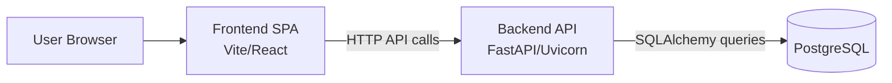

# Architecture Overview (Issue #302)

## Status

- Current architecture: containerized monolith
- Decision date: 2026-03-21
- Decision owner: engineering

## Short Answer

The platform is containerized, but it is not currently a microservice architecture.

## Current Architecture (As Built)

- One frontend SPA (`frontend/`) served as one deployable unit
- One backend API (`backend/`) served as one deployable unit
- One primary relational database (PostgreSQL)
- One compose/system-level deployment workflow that ships these parts together

## Containerized vs Microserviced

Containerized means runtime packaging and deployment are isolated in containers.

Microserviced means the system is split into independent services that have:

- independent deployability
- independent scaling
- independent failure domains
- explicit API contracts between services
- service-level ownership and lifecycle boundaries

Our current stack does not yet meet these microservice criteria.

## Natural Service Boundaries (If We Evolve Later)

Potential candidates if future scale or team topology requires decomposition:

- data ingestion/sync pipelines
- scoring and simulation compute workloads
- notifications/reporting delivery

These are not separate services today. They remain modules inside the backend codebase.

## Decision

For near-term delivery, the project remains a containerized modular monolith.

Rationale:

- lower operational complexity for a small team
- simpler local development and deployment
- fewer network and observability failure points
- easier transactional consistency while core features stabilize

## Revisit Triggers

Revisit microservice decomposition when one or more signals are sustained:

- backend module release cadence causes cross-team blocking
- specific workloads require independent horizontal scaling
- uptime requirements need stricter service isolation
- deployment blast radius becomes operationally expensive

## Decision Matrix (Operational Revisit Rubric)

Use this matrix after production launch to decide whether to keep the modular monolith or split a service boundary.

| Signal | Measure | Keep Monolith Guidance | Split Candidate Guidance |
| --- | --- | --- | --- |
| Team ownership contention | Number of blocked releases per month due to unrelated backend changes | 0-1 blocked releases/month | 3+ blocked releases/month for 2+ consecutive months |
| Independent scaling need | Ratio between peak-heavy workload demand and baseline API demand | Less than 2x | Greater than or equal to 4x and recurring weekly |
| Reliability isolation pressure | Incidents where one subsystem degraded unrelated user paths | 0-1 incident/quarter | 2+ incidents/quarter tied to same subsystem |
| Deploy blast radius | Percentage of deploys requiring full backend rollout for local changes | Less than 50% | Greater than or equal to 80% for 2+ consecutive sprints |
| Recovery speed pressure | Mean time to recover (MTTR) for subsystem failures | Less than 30 minutes | Greater than 60 minutes where isolation would reduce impact |
| Data consistency complexity | Cross-domain transactions needing strict ACID in one request | Frequent and core to user paths | Mostly asynchronous/event-friendly workflows |

Interpretation:

- If 0-1 split indicators are true, continue as modular monolith.
- If 2 indicators are true for 2+ review cycles, run a design spike for one service extraction.
- If 3+ indicators are true for 2+ review cycles, prioritize extracting the highest-impact boundary.

## Revisit Cadence

Run a formal architecture review at the following checkpoints:

- 30 days after production go-live
- 90 days after production go-live
- quarterly thereafter

For each review, capture:

- current metric values for each matrix signal
- whether each signal is monolith-favoring or split-favoring
- recommendation for the next quarter (stay monolith, design spike, or extract one service)

## Recommended First Extraction Order (If Triggered)

If the matrix indicates a split, extract one boundary at a time in this order:

1. ingestion/sync pipelines
2. scoring and simulation compute workloads
3. notifications/reporting delivery

This ordering minimizes user-facing risk by separating the most batch-oriented or compute-heavy responsibilities first.
