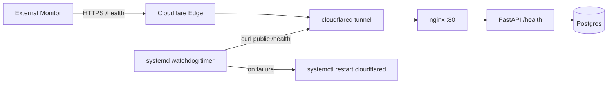

# Cloudflare Tunnel Monitoring Playbook

Date: 2026-03-10
Related Issue: #209

## Goal
Provide lightweight, Pi-friendly observability for Cloudflare Tunnel uptime and failure recovery.

## Architecture
- `cloudflared.service` keeps the tunnel process alive with `Restart=on-failure`.
- `cloudflared-watchdog.timer` executes every minute and checks `https://pplinsighthub.com/health`.
- Backend `/health` endpoint verifies app process and DB reachability.
- Optional external monitor (UptimeRobot, Healthchecks.io, Pulsetic) verifies public endpoint availability.

## Mermaid Diagram


## 1. Tunnel Health Checks
Use `deploy/cloudflared/config.ppl-insight-hub-prod1.example.yml` as baseline.

Recommended ingress block settings:
- `healthcheck.path: /health`
- `healthcheck.interval: 30s`
- `healthcheck.timeout: 5s`
- `healthcheck.retries: 2`
- `originRequest.connectTimeout: 5s`

## 2. Local Monitoring With systemd
Example files:
- `deploy/systemd/cloudflared.service.example`
- `deploy/systemd/cloudflared-watchdog.service.example`
- `deploy/systemd/cloudflared-watchdog.timer.example`

Install flow on Pi:
```bash
sudo cp deploy/systemd/cloudflared.service.example /etc/systemd/system/cloudflared.service
sudo cp deploy/systemd/cloudflared-watchdog.service.example /etc/systemd/system/cloudflared-watchdog.service
sudo cp deploy/systemd/cloudflared-watchdog.timer.example /etc/systemd/system/cloudflared-watchdog.timer
sudo systemctl daemon-reload
sudo systemctl enable --now cloudflared.service
sudo systemctl enable --now cloudflared-watchdog.timer
```

Or use the one-command helper:
```bash
sudo bash deploy/systemd/install_cloudflared_monitoring.sh
```

## 3. Logging And Retention
Runtime checks:
```bash
systemctl status cloudflared --no-pager
journalctl -u cloudflared -n 200 --no-pager
journalctl -u cloudflared --since "-1h" --no-pager
cloudflared tunnel list
cloudflared tunnel info ppl-insight-hub-prod1
```

Suggested journald retention on Pi (`/etc/systemd/journald.conf`):
- `SystemMaxUse=200M`
- `RuntimeMaxUse=50M`
- `MaxRetentionSec=14day`

Apply:
```bash
sudo systemctl restart systemd-journald
```

## 4. Optional Remote Monitoring
Pick one lightweight external monitor:
- UptimeRobot: HTTPS monitor against `https://pplinsighthub.com/health`
- Healthchecks.io: ping URL from watchdog service after successful check
- Pulsetic: HTTPS endpoint monitor with latency and downtime alerting

Alerting target: detect failure within 2-3 minutes.

## 5. Failure Modes And Recovery
### DNS misconfiguration
Symptoms:
- Domain resolves incorrectly or intermittently.

Checks:
```bash
dig +short pplinsighthub.com
cloudflared tunnel route dns
```

Recovery:
- Reapply DNS route from Cloudflare dashboard or CLI.
- Confirm CNAME points to tunnel UUID endpoint.

### Tunnel credential mismatch
Symptoms:
- `cloudflared` starts then exits with auth/credential errors.

Checks:
```bash
journalctl -u cloudflared -n 200 --no-pager
ls -la /etc/cloudflared
```

Recovery:
- Re-download tunnel credentials JSON.
- Validate `tunnel:` value matches credential file tunnel ID.

### Network drop / ISP interruption
Symptoms:
- Reconnect loops, repeated transport errors.

Checks:
```bash
ping -c 4 1.1.1.1
journalctl -u cloudflared --since "-10m" --no-pager
```

Recovery:
- Allow systemd restart loop to recover.
- If prolonged, restart network stack or device.

### Cloudflare API/edge outage
Symptoms:
- Local health is green, external monitor red.

Checks:
- Cloudflare status page
- Compare local `curl http://127.0.0.1:8000/health` vs public endpoint

Recovery:
- Keep local service up and monitor status page.
- Suppress noisy alerts until platform recovers.

## Acceptance Mapping
- Tunnel health checks configured: yes (template)
- Failure detectable in minutes: yes (watchdog timer + external monitor)
- systemd restart reliability: yes (`Restart=on-failure`, tuning in service template)
- Logs retained and observable: yes (journalctl + retention guidance)
- Clear playbook: yes (this document)
