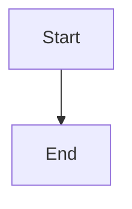

# Workflow Diagrams

This directory contains [Mermaid](https://mermaid.js.org/) diagrams that document the core platform workflows. Diagrams render natively in GitHub's Markdown viewer — no external tools or plugins required.

## Available Diagrams

| File | Description |
|------|-------------|
| [draft-flow.md](./draft-flow.md) | Auction draft flow — nomination, bidding, and roster assignment |
| [waiver-flow.md](./waiver-flow.md) | Waiver / FAAB processing — claim queue, sorting, and ledger deduction |
| [ledger-model.md](./ledger-model.md) | Ledger interaction model — how user actions create ledger entries and update balances |
| [simulation-pipeline.md](./simulation-pipeline.md) | Draft strategy simulation pipeline — Monte Carlo iterations and result aggregation |

## How to Edit Mermaid Diagrams

Mermaid diagrams are written as fenced code blocks with the `mermaid` language tag inside a Markdown file:

````markdown

````

### Editing Locally

1. Open any `.md` file in this directory with your preferred editor.
2. Modify the content inside the ` ```mermaid ` ... ` ``` ` block.
3. Use the [Mermaid Live Editor](https://mermaid.live/) to preview and validate your changes before committing.

### Editing on GitHub

1. Open the file on GitHub and click the pencil (✏️) icon to edit.
2. GitHub will render a live preview of the diagram in the **Preview** tab.
3. Commit your changes directly from the browser.

### Diagram Types Used

| Diagram | Type | Keyword |
|---------|------|---------|
| Draft Flow | Top-down flowchart | `flowchart TD` |
| Waiver Flow | Top-down flowchart | `flowchart TD` |
| Ledger Model | Left-to-right flowchart | `flowchart LR` |
| Simulation Pipeline | Top-down flowchart | `flowchart TD` |

### Common Syntax Reference

```
flowchart TD          # Top-down direction (also: LR = left-right, BT = bottom-top)

A[Rectangle]          # Node with rectangle shape
B{Diamond}            # Decision node (diamond shape)
C([Rounded])          # Node with rounded corners

A --> B               # Solid arrow
A -->|Label| B        # Labeled arrow
A --- B               # Line without arrowhead
```

For the full Mermaid syntax reference, see the [official documentation](https://mermaid.js.org/syntax/flowchart.html).

## Guidelines

- Keep diagrams simple and focused on a single workflow.
- Use plain ASCII labels to ensure compatibility with GitHub's Mermaid renderer.
- Avoid advanced Mermaid features (subgraphs with complex styling, `%%{init}%%` directives) that may not render on GitHub's free tier.
- All diagrams are version-controlled — treat them like code and open a PR for changes.
