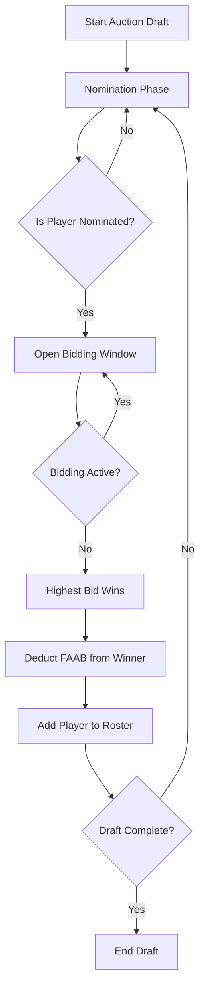

# Auction Draft Flow

This diagram illustrates the step-by-step flow of an auction draft session, from the nomination phase through bidding and roster assignment.

```mermaid
flowchart TD
    A[Start Auction Draft] --> B[Nomination Phase]
    B --> C{Is Player Nominated?}
    C -->|Yes| D[Open Bidding Window]
    C -->|No| B
    D --> E{Bidding Active?}
    E -->|Yes| D
    E -->|No| F[Highest Bid Wins]
    F --> G[Deduct FAAB from Winner]
    G --> H[Add Player to Roster]
    H --> I{Draft Complete?}
    I -->|No| B
    I -->|Yes| J[End Draft]
```
