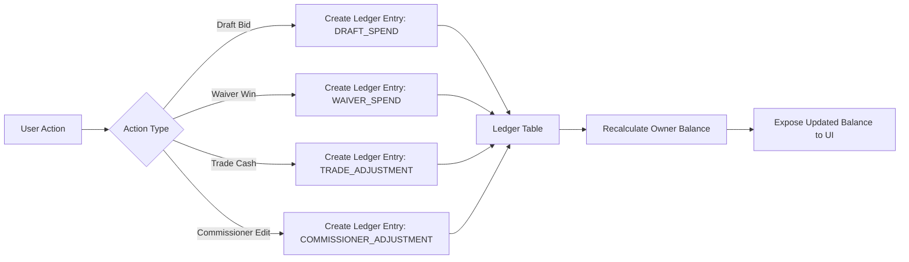

# Ledger Interaction Model

This diagram shows how different user actions create ledger entries, which are aggregated to calculate and expose each owner's current FAAB balance.

```mermaid
flowchart LR
    A[User Action] --> B{Action Type}
    B -->|Draft Bid| C[Create Ledger Entry: DRAFT_SPEND]
    B -->|Waiver Win| D[Create Ledger Entry: WAIVER_SPEND]
    B -->|Trade Cash| E[Create Ledger Entry: TRADE_ADJUSTMENT]
    B -->|Commissioner Edit| F[Create Ledger Entry: COMMISSIONER_ADJUSTMENT]
    C --> G[Ledger Table]
    D --> G
    E --> G
    F --> G
    G --> H[Recalculate Owner Balance]
    H --> I[Expose Updated Balance to UI]
```
