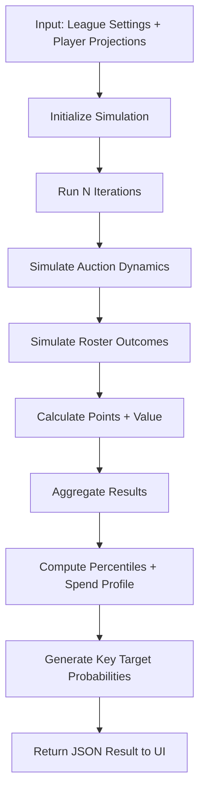

# Simulation Pipeline (Draft Strategy Simulator)

This diagram outlines the Monte Carlo simulation pipeline used to model auction draft strategies, roster outcomes, and projected value distributions.

