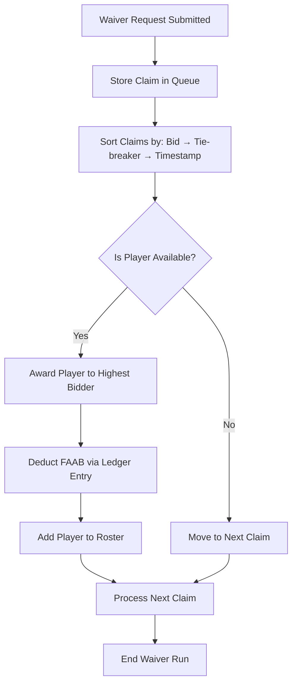

# Waiver / FAAB Flow

This diagram illustrates how waiver wire claims are submitted, sorted, and processed using Free Agent Acquisition Budget (FAAB) bidding.

```mermaid
flowchart TD
    A[Waiver Request Submitted] --> B[Store Claim in Queue]
    B --> C[Sort Claims by: Bid → Tie-breaker → Timestamp]
    C --> D{Is Player Available?}
    D -->|Yes| E[Award Player to Highest Bidder]
    D -->|No| F[Move to Next Claim]
    E --> G[Deduct FAAB via Ledger Entry]
    G --> H[Add Player to Roster]
    H --> I[Process Next Claim]
    F --> I
    I --> J[End Waiver Run]
```
